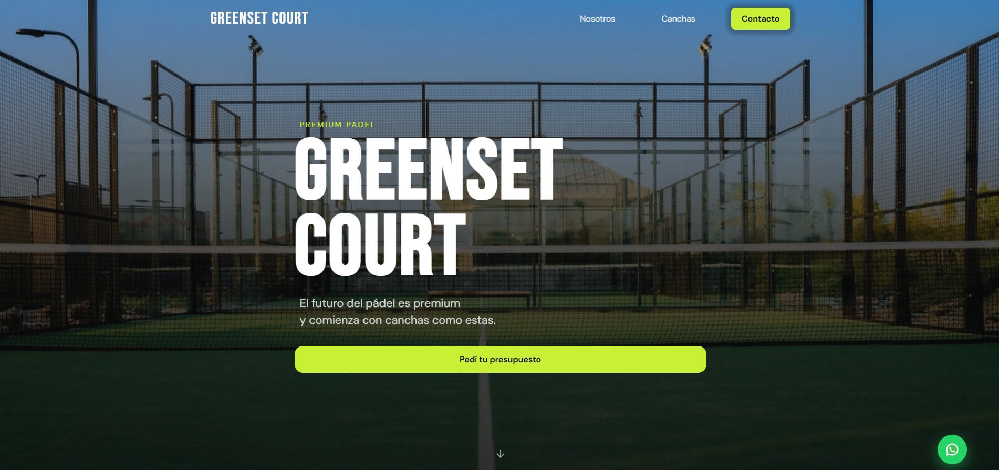
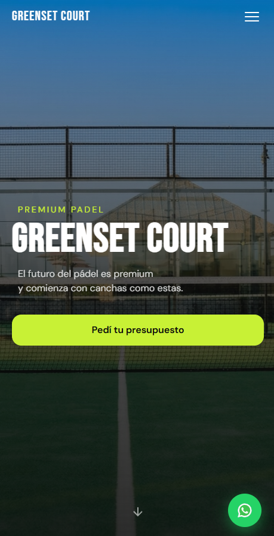

# Greenset Court — Landing Page

Landing page para **Greenset Court**, empresa de venta e instalación de canchas de pádel premium.

🔗 **[Ver en vivo → greenset-landing.vercel.app](https://greenset-landing.vercel.app/)**

   

## Preview

### Desktop

### Mobile

## Stack

- HTML5 semántico
- CSS3 con custom properties, BEM y media queries (mobile → tablet → desktop → wide)
- JavaScript vanilla (Intersection Observer, contadores animados, parallax, validación de formulario)
- Deploy en Vercel con dominio custom vía Cloudflare

## Características

- Diseño mobile-first completamente responsive
- Formulario de contacto con validación y envío directo a WhatsApp
- Animaciones de scroll con Intersection Observer
- Parallax en el hero
- Contadores animados en la sección de estadísticas
- Accesibilidad: aria-labels, prefers-reduced-motion, focus-visible
- Performance: fuentes con lazy load, imágenes optimizadas en WebP

## Licencia

MIT
